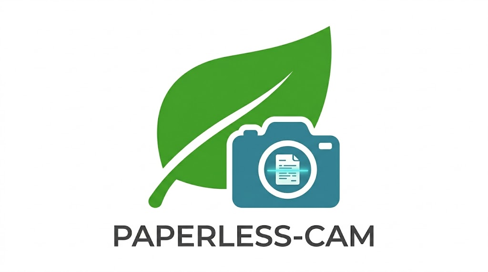

# paperless-cam

paperless-cam turns a fixed overhead USB webcam into a tiny document scanning
appliance for [Paperless-ngx](https://docs.paperless-ngx.com/). Put a page on
the marked area of your desk, open the local web UI from a phone/tablet/laptop,
capture pages, then finalize them into a PDF that lands directly in the
Paperless-ngx consume directory.

The UI is intentionally small:

- live camera preview
- **Add another photo**
- **Done & Upload**
- **New**
- automatic blur/readability feedback with a green or red scanner border

No image data leaves your LAN.

## How It Works

```text
Phone/iPad Browser
        |
        | HTTP + MJPEG
        v
Flask app in Docker
        |
        | OpenCV frame capture
        v
/dev/video0 USB webcam
        |
        | blur check, edge detection, deskew, B&W cleanup
        v
staged page images
        |
        | img2pdf
        v
Paperless-ngx /consume directory
```

The server must run on the machine, VM, or LXC that can see the USB webcam.
Browsers only act as remote controls.

## Quick Start

```bash
git clone https://github.com/bernardc6/paperless-cam.git
cd paperless-cam
cp .env.example .env
docker compose up --build
```

Open:

```text
http://localhost:5000
```

From another device on your LAN, replace `localhost` with the scanner machine's
IP address.

## Paperless-ngx Consume Directory

paperless-cam writes PDFs into `PAPERLESS_CAM_CONSUME_DIR`. In Docker Compose,
the default local `./consume` folder is mounted to `/consume` inside the
container.

For a real Paperless-ngx deployment, mount the same host directory into both
containers:

```yaml
services:
  paperless-cam:
    volumes:
      - "/srv/paperless/consume:/consume"

  paperless-ngx:
    volumes:
      - "/srv/paperless/consume:/usr/src/paperless/consume"
```

Adjust the Paperless-ngx path to match your existing deployment.

## Configuration

| Variable | Default | Purpose |
| --- | --- | --- |
| `PAPERLESS_CAM_CONSUME_DIR` | `/consume` | Directory where final PDFs are written for Paperless-ngx ingestion. |
| `PAPERLESS_CAM_CAMERA_INDEX` | `0` | OpenCV camera index. Use `1`, `2`, etc. for other webcams. |
| `PAPERLESS_CAM_CAMERA_WIDTH` | `1920` | Requested high-resolution capture width. |
| `PAPERLESS_CAM_CAMERA_HEIGHT` | `1080` | Requested high-resolution capture height. |
| `PAPERLESS_CAM_PREVIEW_WIDTH` | `960` | Width of the lower-bandwidth MJPEG preview stream. |
| `PAPERLESS_CAM_BLUR_THRESHOLD` | `100.0` | Minimum variance of Laplacian score considered readable. |
| `PAPERLESS_CAM_MIN_CONTOUR_AREA` | `50000` | Minimum detected document contour size in pixels. |
| `PAPERLESS_CAM_STAGE_DIR` | `/tmp/paperless-cam` | Temporary page image staging directory. |
| `PAPERLESS_CAM_DEBUG_NO_CAMERA` | `false` | Shows a generated test frame when no webcam is attached. |

## USB Webcam Notes

On Linux, webcams usually appear as `/dev/video0`, `/dev/video1`, etc.

```bash
ls /dev/video*
```

The compose file passes `/dev/video0` into the container:

```yaml
devices:
  - "/dev/video0:/dev/video0"
```

For Proxmox LXC, pass the USB video device through to the container first, then
run Docker/Compose inside that environment. The app itself only needs read
access to the video device and write access to the consume directory.

## Computer Vision Pipeline

Each capture runs through a local OpenCV pipeline:

1. Blur detection using variance of the Laplacian.
2. Gaussian blur and Canny edge detection.
3. Largest four-corner contour selection.
4. Perspective transform to flatten the page.
5. Adaptive Gaussian thresholding for high-contrast black-and-white output.

If a document contour is not found, the app still captures the frame but marks
it red so the user can reposition the page.

## Run Without Docker

```bash
python3.11 -m venv .venv
. .venv/bin/activate
pip install -r requirements.txt
python app.py
```

Use `PAPERLESS_CAM_DEBUG_NO_CAMERA=true python app.py` to test the UI without a
physical webcam.

## Development

```bash
python3.11 -m venv .venv
. .venv/bin/activate
pip install -r requirements-dev.txt
pytest
docker build -t paperless-cam:dev .
```

## Status

This is an early open-source MVP for a reliable, appliance-like Paperless-ngx
scanner. The immediate priorities are dependable capture, clear UI feedback,
simple deployment, and easy tuning for different webcam/lighting setups.

## License

MIT

### Disclosure: THIS IS A FULLY AI-GENERATED CODEBASE


### Disclosure: THIS IS A FULLY AI-GENERATED CODEBASE
